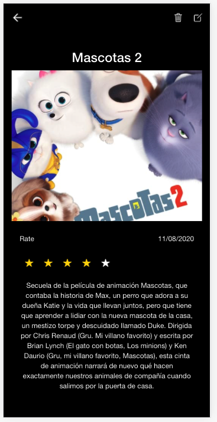

## Desarrollo aplicación mobile Prex

La aplicación utiliza la API de https://api.themoviedb.org para obtener la informacion de las peliculas. Una vez obtenida los datos se almacenan en el storage para editar su contenido.

Los pasos a seguir para realizar la instalación son:

### Step 1: Descargar proyecto
```` 
git clone https://github.com/joaquinrivera19/prex.git
```` 

### Step 2: Instalar los paquetes
```` 
npm install
```` 

### Step 3: Levantar servicio de ionic
```` 
ionic server
```` 


<p align="center"></p>

<p align="center"></p>

<p align="center"></p>